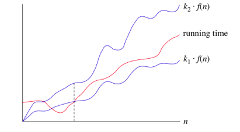

#  Algorithm Complexity Analysis

$a^2 + b^2 = c^2$

## Logarithmic Review

- ${log({a^b})}={b . log(a)}$

- $log(a^b) ={b . log(a)}$

- $a^2 + b^2 = c^2$

$$
f(x) = \int_{-\infty}^\infty
\hat f(\xi)\,e^{2 \pi i \xi x}
\,d\xi
$$

- ${log_b ({a}) = {c}} \leftrightarrow {b^c} = {a}$

- ${log_a({n})} = \frac{log_b(n)}{log_b({a})}$

## Big-Θ (Big-Theta) notation

- When we say that particular running time is $theta({n})$ it means that when ${n}$ gets big enough, runnig time will be at least k\(_{\text{1}}\) \* \({n}\) and at most k\(_{\text{2}}\) \* \({n}\) for some constant k\(_{\text{1}}\) \& k\(_{\text{2}}\).
- For small values of n we do not care how running time compares to k\(_{\text{1}}\) \* \({n}\) and k\(_{\text{2}}\) \* \({n}\).
- We are not stricted to \({n}\) we can use any function as \({n^2}\) or \({n}\*{log(n)}\) or any function.
- We are usually using \({log({n}})\) or \(log_2({n})\) in \(\theta\) notation ............... look at equation(2)

### 1. Order or growth

- constant $theta(n)$
- Logarithmic $theta(lg({n}))$
- polynomials $theta({n}), theta({n^2}), theta({n^3}), ...$
- exponentials $theta({2^n})$

### 2. Hints

- $5^{log_2({n})} = {n^{log_2(5)}} = {n^{2.321}}$
- $\sqrt(n)= n^\frac{1}{2}$
- $2^{2n}={(2^2)^n}={4^n}$

## Big-O notation

- We use big-O notation for asymptotic upper bounds, since it bounds the growth of the running time from above for large enough input sizes.
- Big O notation is only giving the maximum running time with out caring about the minimum.
- Recall that we write f(n)=O(g(n)) to express the fact that f(n) grows no faster than g(n): there exist constants N and c>0 so that for all n \(\ge\) N, f(n) \(\le\) c \* g(n).

## Big- $Omega$ notation

- We use big-\(\Omega\) notation for asymptotic lower bounds.
- We use it to say that it will take at least this amount of time to run this algorithm.

Examples:

- For the functions, \({n^k}\), \({c^n}\)​​, what is the asymptotic relationship between these functions? Assume that k >= 1 and c > 1 are constants.
  - Answer: \({n^k}\) is O(\({c^n}\))
- For the functions, \({8^n}\), \({4^n}\), what is the asymptotic relationship between these functions?
  - Answer: \({8^n}\) is \(\Omega({4^n})\)
