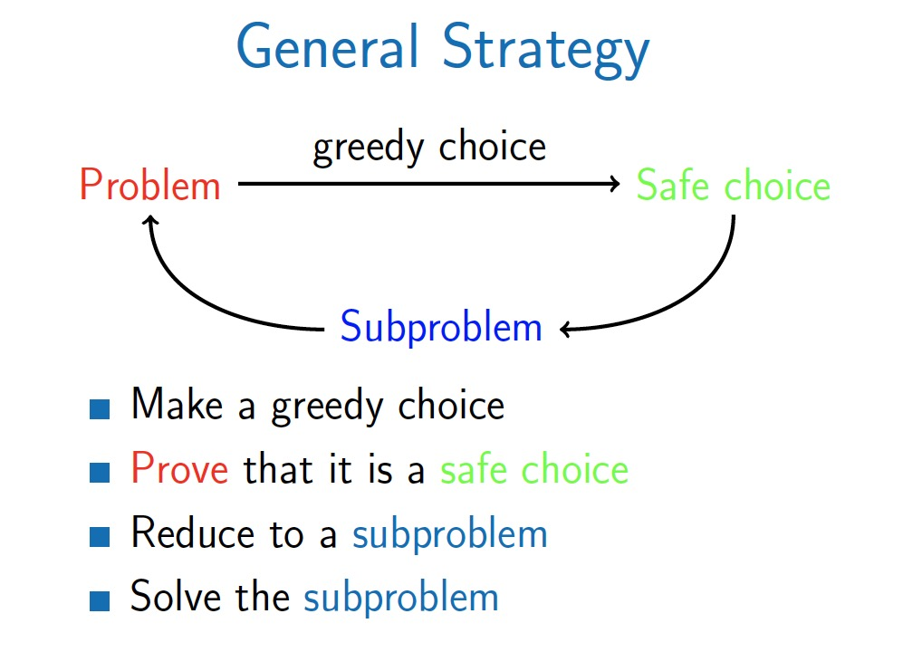

# Greedy Algorithms

## Greedy Strategy

1. Make some greedy choice
2. Reduce to a smaller problem
3. Iterate

- ***Subproblem*** is a similar problem of smaller size.
    - e.g: MaximumSalary(1, 9, 8, 9, 6) = ‘‘9'' + MaximumSalary(1, 8, 9, 6)

### Safe Choice

- A greedy choice is called a **safe choice** if there is an optimal solution consistent with this first choice.
- Not all first choices are safe
- Greedy choices are often unsafe

## Problems that Can Be Solved with Greedy Algorithms

- Covering points by segments
- knapsack / maximize loot (non-fractional items)

## Notes

- Consider sorting the greedy choices, it might make things faster.

[Top 7 Greedy Algorithm Problems](https://medium.com/techie-delight/top-7-greedy-algorithm-problems-3885feaf9430)
