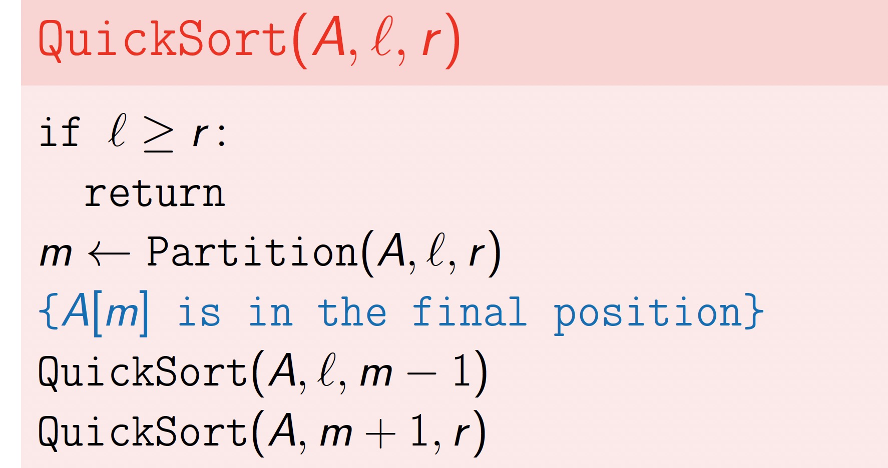
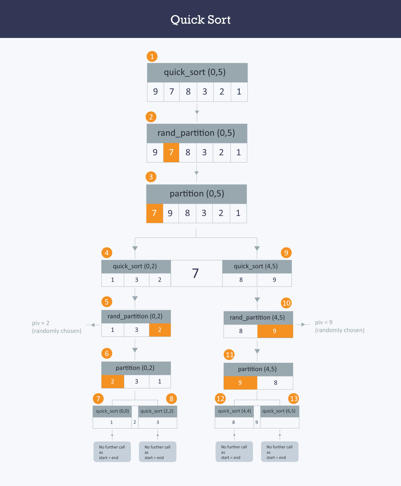

# Quick Sort

- comparison-based algorithm
- running time: O(n log n) (on average)
- efficient in practice


> Assume that all the elements of A[1 . . . n] are pairwise different. Then the average running time of RandomizedQuickSort(A) is O(n log n) while the worst-case running time is O(n2).
>

```java
int partition ( int A[],int start ,int end) {
    int i = start + 1;
    int piv = A[start] ;            //make the first element as pivot element.
    for(int j =start + 1; j <= end ; j++ )  {
    /*rearrange the array by putting elements which are less than pivot
       on one side and which are greater that on other. */

          if ( A[ j ] < piv) {
                 swap (A[ i ],A [ j ]);
            i += 1;
        }
   }
   swap ( A[ start ] ,A[ i-1 ] ) ;  //put the pivot element in its proper place.
   return i-1;                      //return the position of the pivot
}

void quick_sort ( int A[ ] ,int start , int end ) {
   if( start < end ) {
        //stores the position of pivot element
         int piv_pos = partition (A,start , end ) ;
         quick_sort (A,start , piv_pos -1);    //sorts the left side of pivot.
         quick_sort ( A,piv_pos +1 , end) ; //sorts the right side of pivot.
   }
}
```


To handle equal elements, we replace the line `m ← Partition(A, ℓ, r )`
with the line `(m1,m2) ← Partition3(A, ℓ, r )`
such that
for all ℓ ≤ k ≤ m1 − 1, A[k] < x
for all m1 ≤ k ≤ m2, A[k] = x
for all m2 + 1 ≤ k ≤ r , A[k] > x
