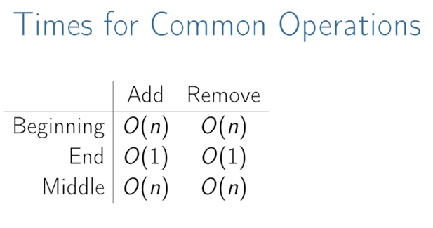

# Array

## Mean Features

- A contiguous area of memory consisting of equal-size elements indexed by contiguous integers.
- Constant time access `array_addr + elem_size x (i - first_index)`
- **Array:** contiguous area of memory consisting of equal-size elements indexed by contiguous integers.
- Constant-time access to any element.
- Constant time to add/remove at the end.
- Linear time to add/remove at an arbitrary location.

## Times for Common Operations

| ---       | Add  | Remove |
| --------- | ---- | ------ |
| Beginning | O(n) | O(n)   |
| End       | O(1) | O(1)   |
| Middle | O(n) | O(n)   |



### Space

- contiguous in memory, so proximity helps performance
- space needed = (array capacity, which is >= n) \* size of item, but even if 2n, still O(n)

## Todo

- Implement a vector (mutable array with automatic resizing):
- Practice coding using arrays and pointers, and pointer math to jump to an index instead of using indexing.
- new raw data array with allocated memory
  - can allocate int array under the hood, just not use its features
  - start with 16, or if starting number is greater, use power of 2 - 16, 32, 64, 128
- size() - number of items
- capacity() - number of items it can hold
- is_empty()
- at(index) - returns item at given index, blows up if index out of bounds
- push(item)
- insert(index, item) - inserts item at index, shifts that index's value and trailing elements to the right
- prepend(item) - can use insert above at index 0
- pop() - remove from end, return value
- delete(index) - delete item at index, shifting all trailing elements left
- remove(item) - looks for value and removes index holding it (even if in multiple places)
- find(item) - looks for value and returns first index with that value, -1 if not found
- resize(new_capacity) // private function
  - when you reach capacity, resize to double the size
  - when popping an item, if size is 1/4 of capacity, resize to half

## Javascript Array

```javascript
Array
```

### Properties

```javascript
Array.length
```

### ## Array Methods in Javascript [^1]

![[array/array-methods-in-javascript.jpeg]]

```javascript
Array.from()
Array.isArray()
Array.observe()
Array.of()
Array.prototype.concat()
Array.prototype.copyWithin()
Array.prototype.entries()
Array.prototype.every()
Array.prototype.fill()
Array.prototype.filter()
Array.prototype.find()
Array.prototype.findIndex()
Array.prototype.flat()
Array.prototype.flatMap()
Array.prototype.forEach()
Array.prototype.includes()
Array.prototype.indexOf()
Array.prototype.join()
Array.prototype.keys()
Array.prototype.lastIndexOf()
Array.prototype.map()
Array.prototype.pop()
Array.prototype.push()
Array.prototype.reduce()
Array.prototype.reduceRight()
Array.prototype.reverse()
Array.prototype.shift()
Array.prototype.slice()
Array.prototype.some()
Array.prototype.sort()
Array.prototype.splice()
Array.prototype.toLocaleString()
Array.prototype.toSource()
Array.prototype.toString()
Array.prototype.unshift()
Array.prototype.values()
```

## Python Array

### Methods

```python
append() # Adds an element at the end of the list
clear() # Removes all the elements from the list
copy() # Returns a copy of the list
count() # Returns the number of elements with the specified value
extend() # Add the elements of a list (or any iterable), to the end of the current list
index() # Returns the index of the first element with the specified value
insert() # Adds an element at the specified position
pop() # Removes the element at the specified position
remove() # Removes the first item with the specified value
reverse() # Reverses the order of the list
sort() # Sorts the list
```

### Helpers

```python
arr = ['a', 'b']
len(arr) # 2

# iteration
for i in arr:
    print(i)
```

## Resources

- [Arrays (video)](https://www.coursera.org/learn/data-structures/lecture/OsBSF/arrays)
- [Dynamic Arrays (video)](https://www.coursera.org/learn/data-structures/lecture/EwbnV/dynamic-arrays)
- [Jagged Arrays (video)](https://www.youtube.com/watch?v=1jtrQqYpt7g)

[^1]: [Array Methods in Javascript: LinkedIn Post]( <https://www.linkedin.com/feed/update/urn:li:activity:7020322961932861440?utm_source=share&utm_medium=member_desktop>)
