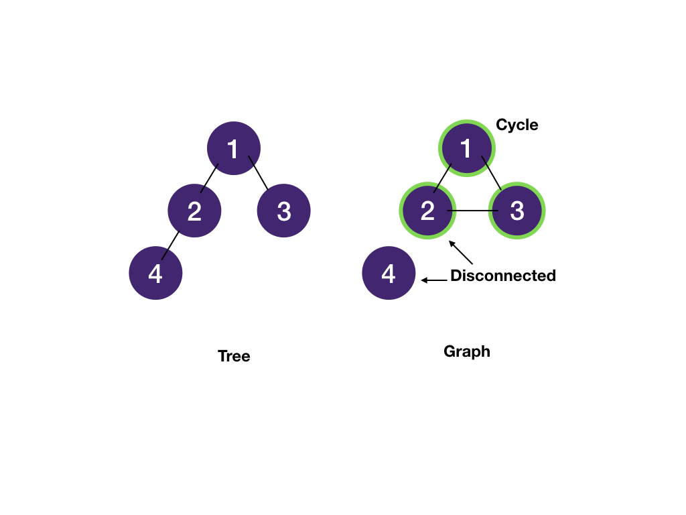
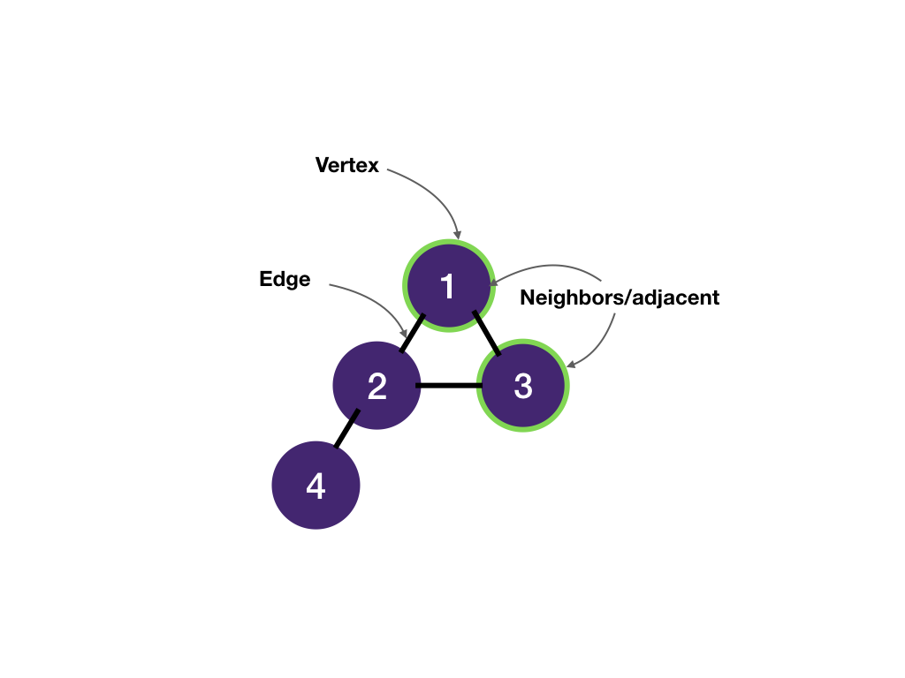
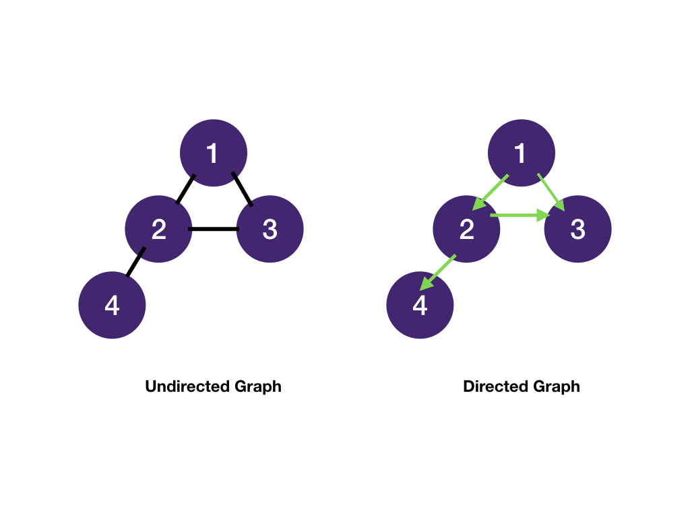
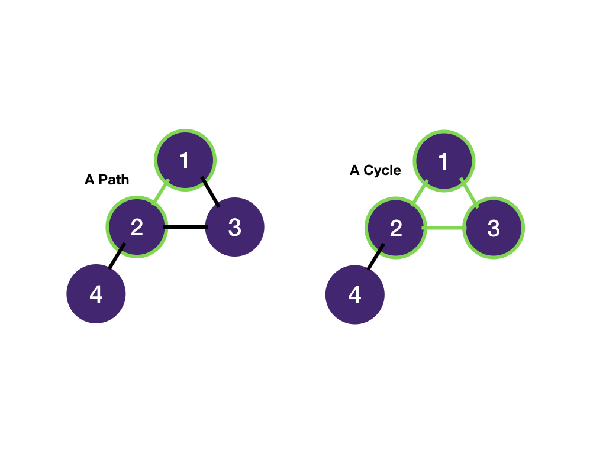
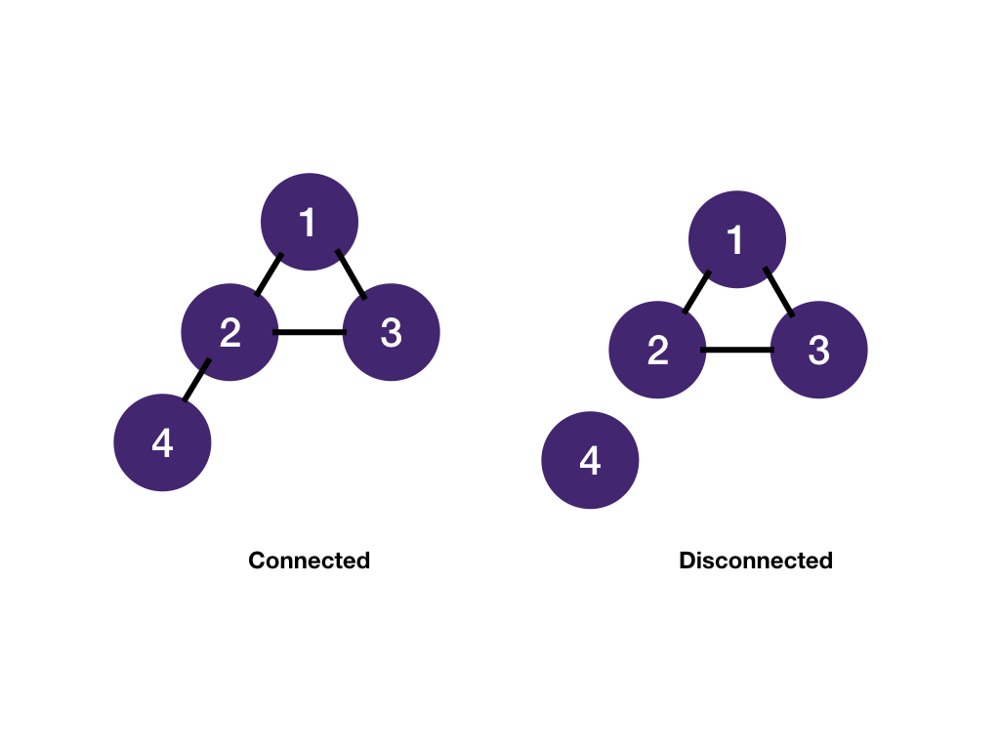
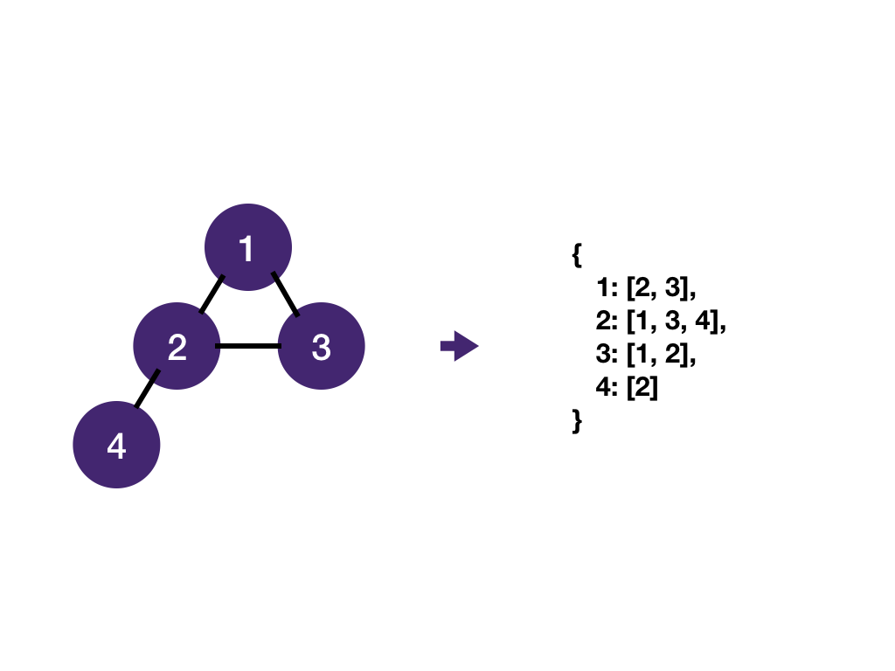

# Graph

## Tree with 0+ Cycle

A tree is a special graph: a *connected* *acyclic* (cycle-less) graph. A graph may contain cycle(s) and nodes could be disconnected.



## Graph Terminologies

A graph consists of **vertices** (“nodes” in trees) and **edges**. Vertices are connected by edges. Two vertices connected by an edge are called **neighbors** and are adjacent (“children” and “parents” in trees).



Edges can be undirected or directed. For most interview problems, we will deal with undirected graphs. A tree is also an undirected graph. We'll discuss directed graphs in the [course schedule](https://www.educative.io/collection/page/5187571686572032/5949303171317760/6328838970671104) module.



A path is a sequence of vertices. A cycle is a path that starts and ends at the same vertex.



An undirected graph is connected if every vertex is joined by a path to another vertex. Otherwise, it's disconnected.



A graph is most commonly stored as a map of adjacency lists: for each vertex, store a list of its neighbors.



Note that even though a graph is represented as an adjacency list, we don't actually have to create it upfront. What we really need is a function to get a vertex's neighbors. We'll see that in the next module.

## Matrix as Graph

Very often, graph problems are represented as matrices. For example:

- [Number of Islands](https://www.educative.io/collection/page/5187571686572032/5949303171317760/5701561555615744)
- [Knight Shortest Path](https://www.educative.io/collection/page/5187571686572032/5949303171317760/6054014759206912)

A matrix translates to a graph (adjacency list):


---

When we code the problem, we have to build the graph as we go. Nodes/vertices are represented by coordinates of matrix entries.

### Getting Neighboring Node's Coordinates

The core of BFS/DFS is to add neighbors of the current vertex to a queue/stack. The `get_neighbors` function returns all 4 coordinates of neighboring nodes (or 8 if you are allowed to go diagonal).

  
One way to get each neighbor's coordinates is to keep each neighbor's horizontal and vertical offsets in a list and adding them to the each vertex's coordinates.

```java
public int numRows = grid.length;
public int numCols = grid[0].length;

public List<Coordinate> getNeighbors(Coordinate coord) {
    int row = coord.row;
    int col = coord.col;
    int[] deltaRow = {-1, 0, 1, 0};
    int[] deltaCol = {0, 1, 0, -1};
    List<Coordinate> res = new ArrayList<>();
    for (int i = 0; i < deltaRow.length; i++) {
        int neighborRow = row + deltaRow[i];
        int neighborCol = col + deltaCol[i];
        if (0 <= neighborRow && neighborRow < numRows &&
            0 <= neighborCol && neighborCol < numCols) {
                res.add(new Coordinate(neighborRow, neighborCol));
            }
    }
    return res;
}
```

## BFS Template

Here's the complete template for BFS on the matrix:

```java
import java.util.*;

public int numRows = grid.length;
public int numCols = grid[0].length;

public List<Coordinate> getNeighbors(Coordinate coord) {
    int row = coord.row;
    int col = coord.col;
    int[] deltaRow = {-1, 0, 1, 0};
    int[] deltaCol = {0, 1, 0, -1};
    List<Coordinate> res = new ArrayList<>();
    for (int i = 0; i < deltaRow.length; i++) {
        int neighborRow = row + deltaRow[i];
        int neighborCol = col + deltaCol[i];
        if (0 <= neighborRow && neighborRow < numRows &&
            0 <= neighborCol && neighborCol < numCols) {
                res.add(new Coordinate(neighborRow, neighborCol));
            }
    }
    return res;
}

public void bfs(Coordinate startingNode) {
    Deque<Coordinate> queue = new ArrayDeque<>();
    queue.add(startingNode);
    Set<Coordinate> visited = new HashSet<>();
    visited.add(startingNode)

    while (queue.size() > 0) {
        Coordinate node = queue.pop();
        for (Coordinate neighbor : getNeighbors(node)) {
            if (visited.contains(neighbor)) continue;
            // Do stuff with the node if required
            // ...
            queue.add(neighbor);
            visited.add(neighbor);
        }
    }
}
```

### Visited Alternative

Sometimes, we can overwrite the value in the matrix to keep track of the visited nodes without using a `visited` set. We'll see this in [Number of Islands](https://www.educative.io/collection/page/5187571686572032/5949303171317760/5701561555615744).
