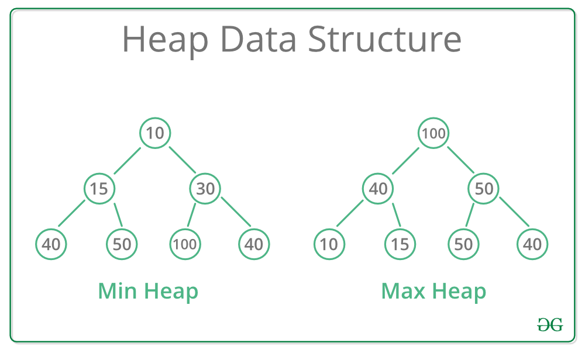

# Heap / Priority Queues

A common misconception is that a Heap is the same as a Priority Queue, which is not true. A priority queue is an abstract data type, while a Heap is a data structure. Therefore, a Heap is not a Priority Queue, but a way to implement a Priority Queue.



- There are two kinds of heaps: **min heap** and **max heap**.
- A min-heap is a tree that has *two properties*:
1. Almost complete, i.e. every level is filled except possibly the last(deepest) level. The filled items in the last level are left-justified.
2. For any node, its key (priority) is greater than its parent's key (Min Heap).

A max heap has the same property #1 and opposite property #2, i.e., for any node, its key is less than its parent's key.

Note that:

- The number in each node is the **key**, not the value (remember a tree node has a value). Keys are used to sort the nodes/construct the tree, and values are the data we want the heap to store.
- Unlike a binary search tree, there is no comparable relationship between children.

## Why Are Heaps Useful?

At first look, the heap is an odd data structure –– it's required to be a complete tree but unlike the binary search tree, it's not sorted across a level.

What makes it so useful is that:

- Because a heap is a complete tree, the height of a heap is guaranteed to be *O*(*log*(*N*)). This makes operations that go from root to leaf guaranteed to be *O*(*log*(*N*)).
- Because only nodes in a root-to-leaf path are sorted (nodes in the same level are not sorted), when we add/remove a node, we only have to fix the order in the vertical path the node is in. This makes inserting and deleting *O*(*log*(*N*)) too.
- Being complete also makes an array a good choice to store a heap since data is continuous. As we will see later in this module, we can find the parent and children of a node simply by doing index arithmetic.

## Algorithms that Use Priority Queues

- Dijkstra's algorithm: finding the shortest path in a graph
- Prim's algorithm: constructing a minimum spanning tree of a graph
- Huffman's algorithm: constructing an optimum prefix-free encoding of a string
- Heap sort: sorting a given sequence

## Operations

## Insert-

To insert a key into a heap

- Place the new key at the first free leaf.
- If property #2 is violated, perform a *bubble-up*.

```python
def bubble_up(node):
    while node.parent exist and node.parent.key > node.key:
        swap node and node.parent
        node = node.parent
```

As the name of the algorithm suggests, it “bubbles up” the new node by swapping it with its parent until the order is correct

Since the height of a heap is O(log(N)), the complexity of bubble-up is O(log(N)).

## delete_min

This operation

- Deletes a node with the min key and returns it.
- Reorganizes the heap so the two properties still hold.

To do that, we

- Remove and return the root since the node with the minimum key is always at the root.
- Replace the root with the last node (the rightmost node at the bottom) of the heap.
- If property #2 is violated, perform a *bubble-down*.

```python
def bubble_down(node):
    while node is not a leaf:
        smallest_child = child of node with smallest key
        if smallest_child < node:
            swap node and smallest_child
            node = smallest_child
        else:
            break
```

What this says is we keep swapping between the current node and its smallest child until we get to the leaf, hence a “bubble down”.

Again, the time complexity is O(log(N))) since the height of a heap is O(log(N)).

## Implementing Heap

- Being a complete tree makes an array a natural choice to implement a heap since it can be stored compactly and wastes no space.
- Pointers are not needed.
- The parent and children of each node can be calculated with index arithmetic.
    - For node `i`, its children are stored at `2i+1` and `2i+2`, and its parent is at `floor((i-1)/2)`. So, instead of `node.left`, we'd do `2*i+1`.
    - This is exactly how the Python language implements heaps.

## Binary Max-heap

A binary max-heap is a binary tree (each node has zero, one, or two children) where the value of each node is at least the values of its children.  
In other words For each edge of the tree, the value of the parent is at least the value of the child.

### Tldr

A heap

- Is a complete tree.
- Allows `O(log(N))` to insert and remove an element with priority.
- is implemented with arrays.
- Each node of a min heap is less than all of its children.

### Heap in Python

Python comes with a built-in `heapq` that we can and it is a **min heap**, i.e. the element at the top is the smallest.

`heapq.heappush` akes two arguments: the first is the heap (an array/list) we want to push the element into and the second argument can be anything as long as it can be used for comparison. Typically, we push a tuple since in Python tuples are compared in an item-by-item order. For example, `(1, 10)` is smaller than `(2, 0)` because the first element is smaller. `(1, 10)` is smaller than `(1, 20)` because when the first item is the same, we compare the next one and in this case 10 is smaller than 20. Typically, we set the first element of the tuple to be the key used for comparison and the last element to the value we want the heap to store.

`heapq.heappop` takes a single argument, a heap, and returns the smallest element in that heap.

```python
import heapq
h = []
heapq.heappush(h, (5, 'write code'))
heapq.heappush(h, (7, 'release product'))
heapq.heappush(h, (1, 'write spec'))
heapq.heappush(h, (3, 'create tests'))
print(heapq.heappop(h))
print(h[0])
```

If the list is known beforehand, we can create a heap out of it by simply using `heapify,` which is actually an O(N)*O*(*N*) operation.

```python
import heapq
arr = [3, 1, 2]
heapq.heapify(arr)
print(arr)
```

### Heap in Java

By default, the Java class `java.util.PriorityQueue` is a **min heap**.

The elements are mostly sorted using their natural comparison methods, but when there isn't one (for example, sorting points by distance), it can be provided by passing in a `Comparator` at construction time.

 A `Comparator` is required if the elements don't implement the `Comparable` interface.

To create a `PriorityQueue` of non-comparable objects, we can use lambda expressions or method reference introduced in Java 8 and provide an inline comparator to the constructor.

```java
import java.util.Comparator;
import java.util.PriorityQueue;

class Task {
    private int priority;
    private String description;

    public Task(int priority, String description) {
        this.priority = priority;
        this.description = description;
    }
    public static void main(String[] args) {
        // initialize a min heap sorted by the priority of tasks with an initial capacity of 5
        PriorityQueue<Task> tasks = new PriorityQueue<>(5, Comparator.comparingInt(t -> t.priority));
        tasks.add(new Task(5, "write code"));
        tasks.add(new Task(7, "release product"));
        tasks.add(new Task(5, "write spec"));
        tasks.add(new Task(3, "create tests"));
        Task head = tasks.poll();  // return the task with min priority
        System.out.println("Task : "+head.description);  // print out "write spec"
    }
}
```

### Heap in JavaScript

JavaScript does not support the heap data structure natively, so you might have to implement your own heap during an interview. Here is a common implementation of min-heap in JavaScript:

```jsx
class HeapItem {
    constructor(item, priority = item) {
        this.item = item;
        this.priority = priority;
    }
}

class MinHeap {
    constructor() {
        this.heap = [];
    }

    push(node) {
        // insert the new node at the end of the heap array
        this.heap.push(node);
        // find the correct position for the new node
        this.bubble_up();
    }

    bubble_up() {
        let index = this.heap.length - 1;

        while (index > 0) {
            const element = this.heap[index];
            const parentIndex = Math.floor((index - 1) / 2);
            const parent = this.heap[parentIndex];

            if (parent.priority <= element.priority) break;
            // if the parent is bigger than the child then swap the parent and child
            this.heap[index] = parent;
            this.heap[parentIndex] = element;
            index = parentIndex;
        }
    }

    pop() {
        const min = this.heap[0];
        this.heap[0] = this.heap[this.size() - 1];
        this.heap.pop();
        this.bubble_down();
        return min;
    }

    bubble_down() {
        let index = 0;
        let min = index;
        const n = this.heap.length;

        while (index < n) {
            const left = 2 * index + 1;
            const right = left + 1;
            // check if left or right child is smaller than parent
            if ((left < n && this.heap[left].priority < this.heap[min].priority) ||
            (right < n && this.heap[right].priority < this.heap[min].priority)) {
                // pick the smaller child if both child is present
                if (right < n) {
                    min = this.heap[left].priority < this.heap[right].priority ? left : right;
                } else {
                    min = left;
                }
            }

            if (min === index) break;
            [this.heap[min], this.heap[index]] = [this.heap[index], this.heap[min]];
            index = min;
        }
    }

    peek() {
        return this.heap[0];
    }

    size() {
        return this.heap.length;
    }
}

 const heap = new MinHeap();
 heap.push(new HeapItem("First item"));
 heap.push(new HeapItem("Second item"));
 console.log(heap.pop().item)
 console.log(heap.pop().item)
```

### Implementing Max Heap

- The simplest way to implement a max heap is to reverse the sign of the number before we push it into the heap and reverse it again when you pop it out.

For example, if we want to build a max heap out of `[3, 1, 2]`, we can push `[-3, -1, -2]` into the heap. Because the default heap is a min-heap, when we pop, `3` will be popped out. Its reverse, `3`, is the max of the three and thus we have a max heap.

```java
import java.util.Arrays;
import java.util.PriorityQueue;
import java.util.Scanner;

class Solution {
    public static int[] heapTop3(int[] arr) {
        int[] res = new int[3];
        PriorityQueue<Integer> heap = new PriorityQueue<>();
        for (int i = 0; i < arr.length; i++) {
            heap.add(arr[i]);
        }
        for (int i = 0; i < 3; i++) {
            res[i] = heap.poll();
        }
        return res;
    }
    //Driver code
    public static void main(String[] arg){
        String[] inputs = {"3 1 2 10 33 100 20"};
        for(int i = 0; i < inputs.length; i++) {
            int[] arr = Arrays.stream(inputs[i].split(" ")).mapToInt(Integer::parseInt).toArray();
            System.out.println("Heap top 3 :"+Arrays.toString(Solution.heapTop3(arr)));
        }
    }
}
```

```python
from typing import List
def heap_top_3(arr: List[int]) -> List[int]:
    import heapq
    heapq.heapify(arr)
    res = []
    for i in range(3):
        res.append(heapq.heappop(arr))
    return res

#Driver code
inputs = ["3 1 2 10 33 100 20"]
for i in range(len(inputs)):
    arr = list(map(int, inputs[i].strip().split()))
    print("Heap top 3 :", str(heap_top_3(arr)))
```
