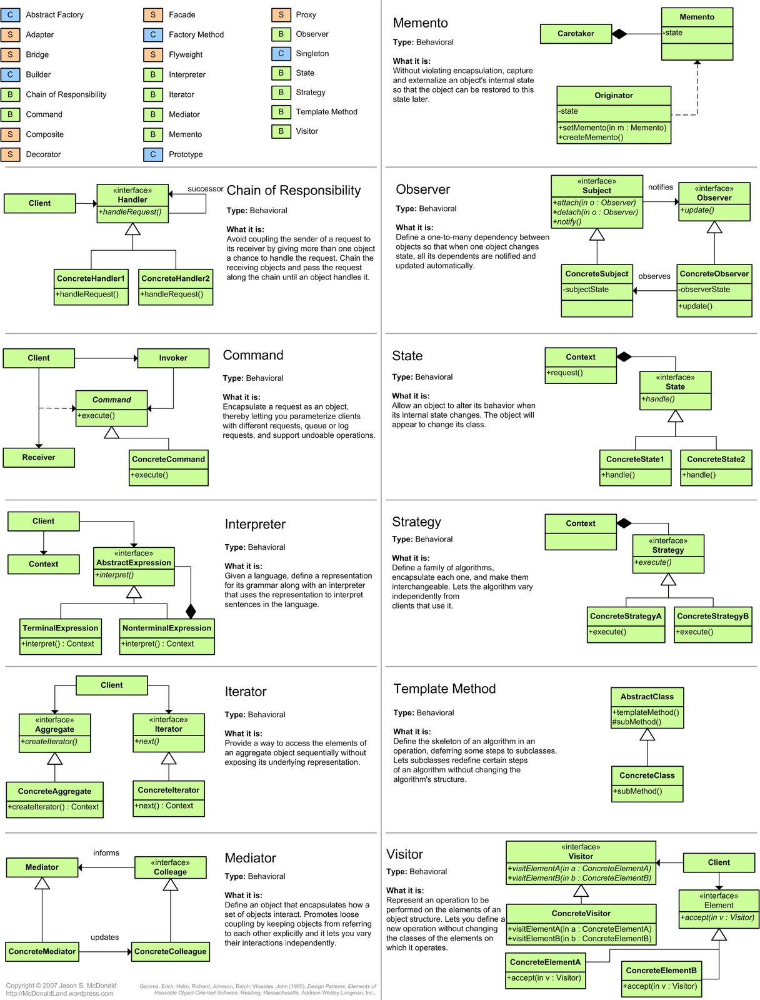
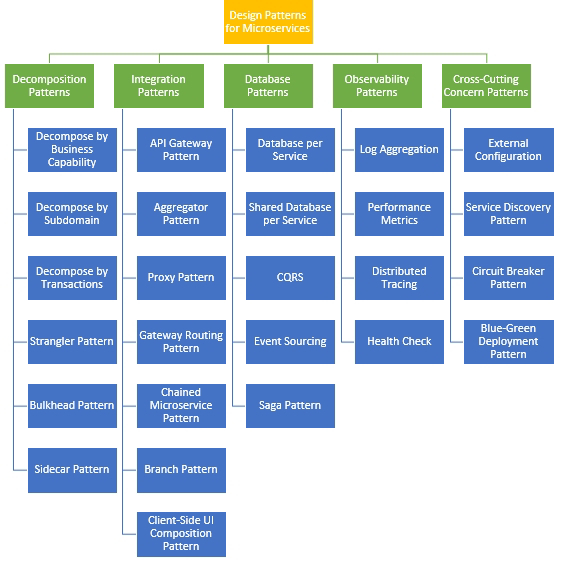

# Design Patterns Best Practices

[1_introduction.pdf](./design-patterns-best-practices/1_introduction.pdf)
[2_types_of_design_patterns.pdf](./design-patterns-best-practices/2_types_of_design_patterns.pdf)
[3_builder_pattern.pdf](./design-patterns-best-practices/3_builder_pattern.pdf)
[4_singleton_pattern.pdf](./design-patterns-best-practices/4_singleton_pattern.pdf)
[5_prototype_pattern.pdf](./design-patterns-best-practices/5_prototype_pattern.pdf)
[6_factory_method_pattern.pdf](./design-patterns-best-practices/6_factory_method_pattern.pdf)
[7_abstract_factory_pattern.pdf](./design-patterns-best-practices/7_abstract_factory_pattern.pdf)
[8_adapter_pattern.pdf](./design-patterns-best-practices/8_adapter_pattern.pdf)
[9_bridge_pattern.pdf](./design-patterns-best-practices/9_bridge_pattern.pdf)
[10_composite_pattern.pdf](./design-patterns-best-practices/10_composite_pattern.pdf)
[11_decorator_pattern.pdf](./design-patterns-best-practices/11_decorator_pattern.pdf)
[12_facade_pattern.pdf](./design-patterns-best-practices/12_facade_pattern.pdf)
[13_flyweight.pdf](./design-patterns-best-practices/13_flyweight.pdf)
[14_proxy_pattern.pdf](./design-patterns-best-practices/14_proxy_pattern.pdf)
[15_chain_of_responsibility_pattern.pdf](./design-patterns-best-practices/15_chain_of_responsibility_pattern.pdf)
[16_observer_pattern.pdf](./design-patterns-best-practices/16_observer_pattern.pdf)
[17_interpreter_pattern.pdf](./design-patterns-best-practices/17_interpreter_pattern.pdf)
[18_command_pattern.pdf](./design-patterns-best-practices/18_command_pattern.pdf)
[19_iterator_pattern.pdf](./design-patterns-best-practices/19_iterator_pattern.pdf)
[20_mediator_pattern.pdf](./design-patterns-best-practices/20_mediator_pattern.pdf)
[21_memento_pattern.pdf](./design-patterns-best-practices/21_memento_pattern.pdf)
[22_state_pattern.pdf](./design-patterns-best-practices/22_state_pattern.pdf)
[23_template_method.pdf](./design-patterns-best-practices/23_template_method.pdf)
[24_strategy_pattern.pdf](./design-patterns-best-practices/24_strategy_pattern.pdf)
[25_visitor_pattern.pdf](./design-patterns-best-practices/25_visitor_pattern.pdf)
[26_summary.pdf](./design-patterns-best-practices/26_summary.pdf)
[27_epilogue.pdf](./design-patterns-best-practices/27_epilogue.pdf)

