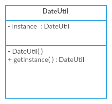

# Singleton

## Uml



## Steps

- Declare the constructor of the class as private
- Declare a static method
- Declare a static member of the same class type in the class

## Implementation

### Lazy Initialisation

```java
public class DateUtil {

    private static DateUtil instance;

    private DateUtil(){}
    public static DateUtil getInstance() {
        if(instance == null){
            instance = new DateUtil();
        }
        return instance;
    }
}
```

### Eager Initialisation

```java
public class DateUtil {

    private static DateUtil instance = new DateUtil();

    private DateUtil(){}

    public static DateUtil getInstance() {
        return instance;
    }
}
```

**OR**

```java
public class DateUtil {

    private static final DateUtil instance;

    static {
        instance = new DateUtil();
    }

    private DateUtil(){}

    public static DateUtil getInstance() {
        return instance;
    }
}
```

### Multithreading Safe

```java
public class DateUtilMultiThreadSafe {
    // SonarLint: Use a thread-safe type; adding "volatile" is not enough to make this field thread-safe. Like in the Logger assignment
    private static volatile DateUtilMultiThreadSafe instance;

    private DateUtilMultiThreadSafe() {}

    public DateUtilMultiThreadSafe getInstance() {
	  // for future:: Avoid double checked syncronzation and syncronize the whole method instead
        if(instance == null) {
            // only in this case we will create a lock on this class (as it's an expensive process)
            synchronized (DateUtilMultiThreadSafe.class) {
                if (instance == null) {
                    instance = new DateUtilMultiThreadSafe();
                }
            }
        }

        return instance;
    }

}
```

### De-serialisation Problem with Singleton

- If we serialise a singleton object to a file and get it back it will not be the same object,
	- to resolve this serialisation issue we have to implement the `Serializable` interface and override the `readResolve` method like this example

```java
import java.io.Serializable;

public class DateUtilDeserializationFixed implements Serializable {
    private static DateUtilDeserializationFixed instance;

    private DateUtilDeserializationFixed() {}

    public static DateUtilDeserializationFixed getInstance() {
        if(instance == null) {
            instance = new DateUtilDeserializationFixed();
        }
        return instance;
    }

    public Object readResolve() {
        return instance;
    }
}
```

- To test it

```java
import java.io.File;
import java.io.FileInputStream;
import java.io.FileOutputStream;
import java.io.IOException;
import java.io.ObjectInputStream;
import java.io.ObjectOutputStream;

public class DateUtilDeserializationFixedTest {

    public static void main(String[] args) throws IOException, ClassNotFoundException {
        DateUtilDeserializationFixed instance1 = DateUtilDeserializationFixed.getInstance();
        DateUtilDeserializationFixed instance2;

        final String filePath = "/Users/aboureadaa/projects/private/notes/Studying/my-own-coding-realm/java/playground/src/main/java/com/aboureada/playground/design_patterns/creational/singleton/DateUtil.ser";

        ObjectOutputStream oos = new ObjectOutputStream(new FileOutputStream(new File(filePath)));
        oos.writeObject(instance1);

        ObjectInputStream ois = new ObjectInputStream(new FileInputStream(new File(filePath)));
        instance2 = (DateUtilDeserializationFixed) ois.readObject();

        System.out.println(instance1 == instance2);

        oos.close();
        ois.close();
    }

}
```

- OR a cleaner version with try_with_resource

```java
import java.io.FileInputStream;
import java.io.FileOutputStream;
import java.io.IOException;
import java.io.ObjectInputStream;
import java.io.ObjectOutputStream;

public class DateUtilDeserializationFixedTest {

    public static void main(String[] args) throws IOException, ClassNotFoundException {
        DateUtilDeserializationFixed instance1 = DateUtilDeserializationFixed.getInstance();
        DateUtilDeserializationFixed instance2;

        final String filePath = "/Users/aboureadaa/projects/private/notes/Studying/my-own-coding-realm/java/playground/src/main/java/com/aboureada/playground/design_patterns/creational/singleton/DateUtil.ser";

        try (ObjectOutputStream oos = new ObjectOutputStream(new FileOutputStream(filePath))) {
            oos.writeObject(instance1);

            try (ObjectInputStream ois = new ObjectInputStream(new FileInputStream(filePath))) {
                instance2 = (DateUtilDeserializationFixed) ois.readObject();
            }
        }

        System.out.println(instance1 == instance2);
    }

}
```

## Assignment

- Implement a logger

```java
import java.io.Serializable;

public class Logger implements Serializable, Cloneable {

    private static Logger instance;

    private Logger() {
    }
    public static synchronized Logger getInstance() {
        if (instance == null) {
            instance = new Logger();
        }
        return instance;
    }

    public void log(String message) {
        System.out.println(message);
    }

    public Object readResolve() {
        return getInstance();
    }

    @Override
    public Object clone() throws CloneNotSupportedException {
        throw new CloneNotSupportedException();
    }

}
```

- Test it

```java
public class LoggerTest {

    public static void main(String[] args) {
        Logger logger1 = Logger.getInstance();
        logger1.log("hey, this is my custom made logger1!");

        Logger logger2 = Logger.getInstance();
        logger2.log("hey, this is my custom made logger2!");

        logger1.log(String.valueOf(logger1 == logger2));

    }

}
```
