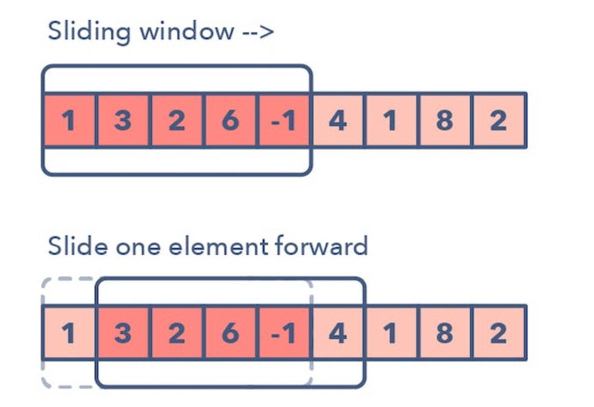

# 01 Sliding Window

Tags:: #Algorithm #Sliding_Window

# 01 Sliding Window

- The Sliding Window pattern is used to perform a required operation on a specific window size of a given array or linked list, such as finding the longest subarray containing all 1s.
- Sliding Windows start from the 1st element and keep shifting right by one element and adjust the length of the window according to the problem that you are solving.
- In some cases, the window size remains constant and in other cases the sizes grows or shrinks.

## Following Are Some Ways You Can Identify that the given Problem Might Require a Sliding Window

- The problem input is a linear data structure such as a linked list, array, or string
- You're asked to find the longest/shortest substring, subarray, or a desired value

## Does My Problem Match This Pattern?

- Yes, if both these conditions are fulfilled:
    - The problem requires repeated computations on a contiguous set of data elements (a subarray or a substring), such that the window moves across the input array from one end to the other. The size of the window may be fixed or variable, depending on the requirements of the problem. The repeated computations may be a direct part of the final solution, or they may be intermediate steps building up towards the final solution.
    - The computations performed every time the window moves take O(1) time or are a slow-growing function, such as log, of a small variable, say k, where k << n.
- No, if either of these conditions are fulfilled:
    - The input data structure does not support random access.
    - You have to process the entire data without segmentation.

## Real-world Problems

Many problems in the real world use the sliding window pattern. Let's look at some examples.

- **Telecommunications:** Find the maximum number of users connected to a cellular network's base station in every kk-millisecond sliding window.
- **E-commerce:** Given a dataset of product IDs in the order they were viewed by the user and a list of products that are likely to be similar, find how many times these products occur together in the dataset.
- **Video streaming:** Given a stream of numbers representing the number of buffering events in a given user session, calculate the median number of buffering events in each one-minute interval.
- **Social media content mining:** Given the lists of topics that two users have posted about, find the shortest sequence of posts by one user that includes all the topics that the other user has posted about.

## Common Problems You Use the Sliding Window Pattern with

- Maximum sum subarray of size ‘K' (easy)
- Longest substring with ‘K' distinct characters (medium)
- String anagrams (hard)

## Example Problems

- [https://leetcode.com/problems/maximum-subarray/](https://leetcode.com/problems/maximum-subarray/) (Blind)
- [https://leetcode.com/problems/minimum-size-subarray-sum/](https://leetcode.com/problems/minimum-size-subarray-sum/)
- [https://leetcode.com/problems/longest-substring-with-at-most-k-distinct-characters/](https://leetcode.com/problems/longest-substring-with-at-most-k-distinct-characters/)
- [https://leetcode.com/problems/fruit-into-baskets/](https://leetcode.com/problems/fruit-into-baskets/)
- [https://leetcode.com/problems/longest-substring-without-repeating-characters/](https://leetcode.com/problems/longest-substring-without-repeating-characters/) (Blind)
- [https://leetcode.com/problems/longest-repeating-character-replacement/](https://leetcode.com/problems/longest-repeating-character-replacement/) (Blind)
- [https://leetcode.com/problems/max-consecutive-ones-iii/](https://leetcode.com/problems/max-consecutive-ones-iii/)
- [https://leetcode.com/problems/permutation-in-string/](https://leetcode.com/problems/permutation-in-string/)
- [https://leetcode.com/problems/find-all-anagrams-in-a-string/](https://leetcode.com/problems/find-all-anagrams-in-a-string/)
- [https://leetcode.com/problems/minimum-window-substring/](https://leetcode.com/problems/minimum-window-substring/) (Blind)
- [https://leetcode.com/problems/substring-with-concatenation-of-all-words/](https://leetcode.com/problems/substring-with-concatenation-of-all-words/)
