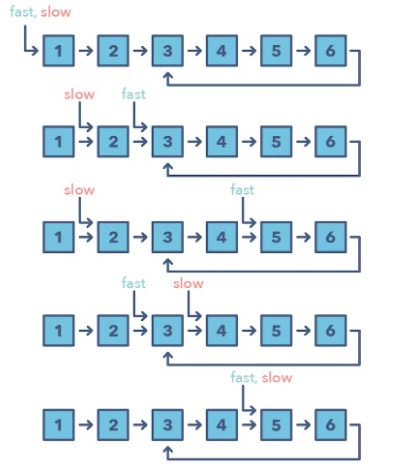

# 03 Fast and Slow Pointers

# 03 Fast and Slow Pointers

- The Fast and Slow pointer approach, also known as the **Hare & Tortoise algorithm**, is a pointer algorithm that uses two pointers which move through the array (or sequence/linked list) at different speeds.
- **This approach is quite useful when dealing with cyclic linked lists or arrays.**
- By moving at different speeds (say, in a cyclic linked list), the algorithm proves that the two pointers are bound to meet.
- The fast pointer should catch the slow pointer once both the pointers are in a cyclic loop.

## How Do You Identify when to Use the Fast and Slow Pattern?

- The problem will deal with a loop in a linked list or array
- When you need to know the position of a certain element or the overall length of the linked list.

## When Should I Use it over the Two Pointer Method Mentioned Above?

- There are some cases where you shouldn't use the Two Pointer approach such as
	- in a singly linked list where you can't move in a backwards direction.
- An example of when to use the Fast and Slow pattern is when you're trying to determine if a linked list is a palindrome.

## Problems Featuring the Fast and Slow Pointers Pattern

- Linked List Cycle (easy)
- Palindrome Linked List (medium)
- Cycle in a Circular Array (hard
