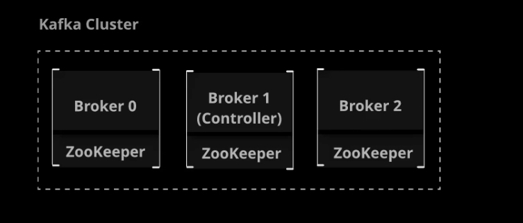
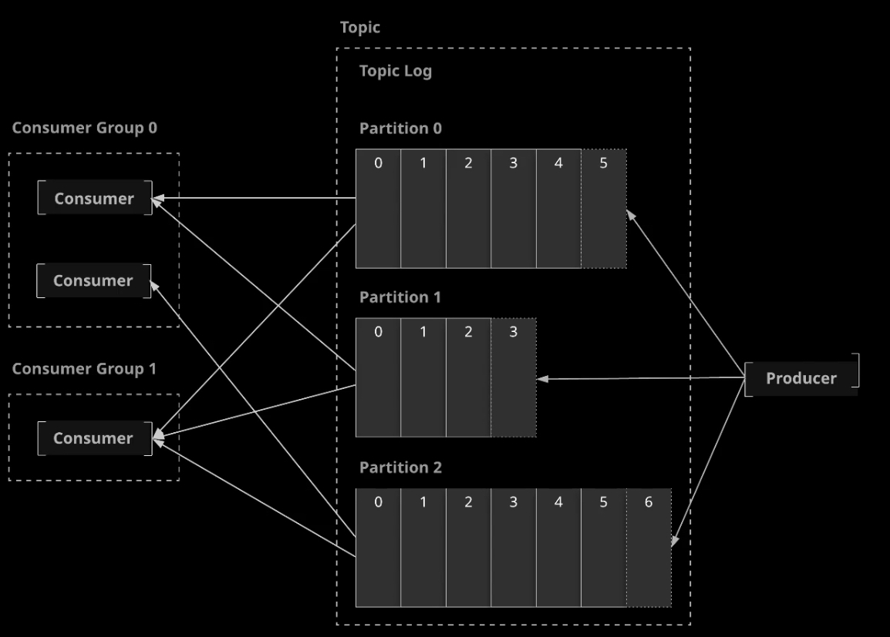
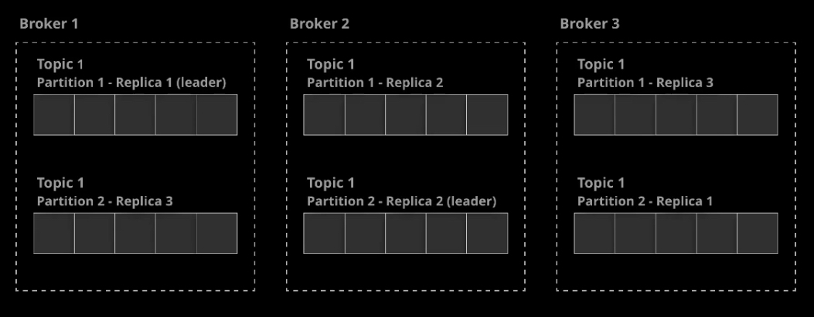
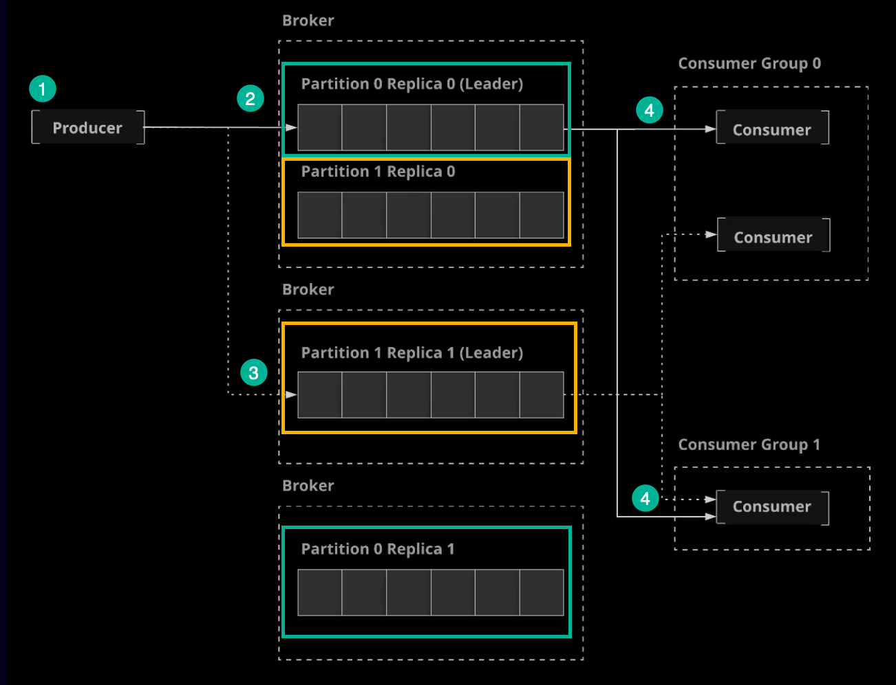

# Kafka - Ccdak Study Notes

## Kafka Architecture



### Brokers

- The central component of Kafka architecture is the broker.
- Brokers are the servers that make up a Kafka cluster (one or more brokers).
- Producers and consumers communicate with brokers in order to publish and consume messages.

### Zookeeper

- Kafka depends on an underlying technology called Zookeeper.
- Zookeeper is a generalized cluster management tool.
- It manages the cluster and provides a consistent, distributed place to store cluster configuration.
- Zookeeper coordinates communication throughout the cluster, adds and removes brokers, and monitors the status of nodes in the cluster.
- It is often installed alongside Kafka, but can be maintained on a completely separate set of servers.

### Networking

- Kafka uses simple TCP protocol to handle messaging communication.

### The Controller

- In a Kafka cluster, one broker is dynamically designated as the _Controller_.
- The controller coordinates the process of assigning partitions and data replicas to nodes in the cluster.
- Every cluster has exactly ONE controller.
- If the controller goes down, another node will automatically become the controller.

## Publisher/Subscriber Messaging in Kafka

### Topics

- **Topics** are at the core of everything you can do in Kafka.
- A topic is a data feed to which data records are published and from which they can be consumed.
- Publishers send data to a topic, and subscribers read data from the topic.
- This is known as _publisher/subscriber messaging_, or simply _pub/sub_ for short.

### The Topic Log

- Kafka topics each maintain a log.
- The **log** is an ordered, immutable list of data records.
- The log for a Kafka topic is usually divided into multiple **partitions**. This is what allows Kafka to process data efficiently and in a scalable fashion.
- Each record in a partition has a sequential, unique ID called an **offset**

### Producers

- A Producer is the publisher in the pub/sub model.
- The producer is simply an application that communicates with the cluster, and can be in a separate process or on a different server.
- Producers write data records to the Kafka topic.
- For each new record, the Producer determines which partition to write to, often in a simple round-robin fashion.
- You can customize this to use a more sophisticated algorithm for determining which topic to write a new record to.

### Consumers

- A Consumer is the subscriber in the pub/sub model.
- Like producers, consumers are external applications that can be in a separate process or on a different server from Kafka itself.
- Consumers read data from Kafka topics.
- Each consumer controls the offset it is currently reading for each partition, and consumers normally read records in order based on the offset.
- You can have any number of consumers for a topic, and they can all process the same records.
- Records are not deleted when they are consumed. They are only deleted based upon a configurable retention period.

### Consumer Groups

By default, all consumers will process all records, but what if you want to scale your record processing so that multiple instances can process the data without two instances processing the same record? You can place consumers into **Consumer Groups**.

- Each record will be consumed by exactly one consumer per consumer group.
- With consumer groups, Kafka dynamically assigns each partition to exactly one consumer in the groups.
- If you have more consumers than partitions, some of the consumers will be idle and will not process records.



### Terms

- **Topic**: A named data feed that data can be written to and read from.
- **Log**: The data structure used to store a topic's data. The log is a partitioned, immutable sequence of data
  records.
- **Partition**: A section of a topic's log.
- **Offset**: The sequential and unique ID of a data record within a partition.
- **Producer**: Something that writes data to a topic.
- **Consumer**: Something that reads data from a topic.
- **Consumer group**: A group of multiple consumers. Normally, multiple consumers can all consume the same record from a
  topic, but only one consumer in a consumer group will consume reach record.

## Partitions and Replication

### Replication

- Kafka is designed with fault tolerance in mind. As a result, it includes built-in support for replication.
- Replication means storing multiple copies of any given piece of data.
- In Kafka, every topic is given a configurable replication factor.
- The replication factor is the number of replicas that will be kept on _different brokers_ for each partition in the topic.



### Leaders

- In order to ensure that messages in a partition are kept in a consistent order across all replicas, Kafka chooses a _leader_ for each partition.
- The leader handles all reads and writes for the partition.
- The leader is dynamically selected and if the leader goes down, the cluster attempts to choose a new leader through a process called **leader election**.
- Leader is the source of truth.

### In-sync Replicas

- Kafka maintains a list of **In-Sync Replicas (ISR)** for each partition.
- ISRs are replicas that are up-to-date with the leader.
- If a leader dies, the new leader is elected from among the ISRs.
- By default, if there are no remaining ISRs when a leader dies, Kafka waits until one becomes available. This means that producers will be on hold until a new leader can be elected.
- You can turn on **unclean leader election**, allowing the cluster to elect a non-in-sync replica in this scenario.

## The Life of a Message



1. Producer publishes a message to a partition within a topic.
2. The message is added to the partition on the leader.
3. The message is copied to the replicas of that partition on other brokers.
4. Consumers read the message and process it.
5. When the retention period for the message is reached, the message is deleted. (default retention period is 7 days).

## The Kafka Java Apis

1. _Producer API_: Allows you to build producers that publish messages to Kafka.
2. _Consumer API_: Allows you to build consumers that read Kafka messages.
3. _Streams API_: Allows you to read from input topics, transform data, and output it to output topics.
4. _Connect API_: Allows you to build custom connectors, which pull from or push to specific external systems.
5. _AdminClient API_: Allows you to, manage and inspect higher-level objects like topics and brokers.

## Streams

### What Are Streams?

- So far, we have discussed using Kafka for messaging (reliably passing data between two applications).
- **Kafka Streams** allows us to build applications that process Kafka data in real-time with ease.
- A Kafka Streams application is an application where both the input and the output are stored in Kafka topics.
- Kafka Streams is a client library (API) that makes it easy to build these application.

### Kafka Streams Transformations

Kafka Streams provides a robust set of tools for processing and transforming data. The Kafka cluster itself serves as
the backend for data management and storage.

There are two types of data transformations in Kafka Streams:

- **Stateless transformations** do not require any additional storage to manage the state.
- **Stateful transformations** require a state store to manage the state.

### Stateless Transformations

1. **Branch**: Splits a stream into multiple streams based on a predicate.
2. **Filter**: Removes messages from the stream based on a condition.
3. **Flat Map**: Takes input records and turns them into a different set of records.
4. **Foreach**: Performs an arbitrary stateless operation on each record. This is a terminal operation and stops further
   Processing.
5. **GroupBy/GroupByKey**: Groups records by their key. This is required to perform stateful transformations.
6. **Map**: Allows you to read a record and produce a new, modified record.
7. **Merge**: Merges two streams into one stream.
8. **Peek**: Similar to Foreach, but does not stop processing.

### Kafka Streams Aggregations

- Stateless transformations, such as _groupByKey_ and _groupBy_ can be used to group records that share the same key.
- Aggregations are _stateful transformations_ that always operate on these groups of records sharing the same key.

### Aggregations

1. _Aggregate_: Generates a new record from a calculation involving the grouped records.
2. _count_: Counts the numbers for each grouped key.
3. _Reduce_: Combines the grouped records into a single record.

[developer-guide aggregating](https://kafka.apache.org/23/documentation/streams/developer-guide/dsl-api.html#aggregating)

## Kafka Streams Joins

Joins are used to combine streams into one new stream.

### Co-partitioning

When joining streams, the data must be co-partitioned:

- Same number of partitions for input topics.
- Same partitioning strategies for producers.

You can avoid the need for co-partitioning by using a _GlobalkTable_.

With _GlobalKTables_, all instances of your streams application will populate the local table with data

### Kafka Streams Join Types

1. **Inner join**: The new stream will contain only records that have a match in both joined streams.
2. **Left Join**: The new stream will contain all records from the first stream, but only matching records from the joined stream.
3. **Outer Join**: The new stream will contain all records from both streams.

[developer-guide joining](https://kafka.apache.org/23/documentation/streams/developer-guide/dsl-api.html#joining)

## Kafka Streams Windowing

_Windows_ are similar to groups in that they deal with a set of records with the same key. However, windows further subdivide groups into “time buckets.”

- **Tumbling Time Windows**: Windows are based on time periods that never overlap or have gaps between them.
- **Hopping Time Windows**: Time-based, but can have overlaps or gaps between windows.
- **Sliding Time Windows**: These windows are dynamically based on the timestamps of records rather than a fixed point in time. They are only used in joins.
- **Session Windows**: Creates windows based on periods of activity. A group of records around the same timestamp will form a session window, whereas a period of “idle time” with no records in the group will not have a window.

### Late-arriving Records

- In real-world scenarios, it is always possible to receive out-of-order data.
- When records fall into a time window received after the end of that window's grace period, they become known as _late-arriving records_.
- You can specify a _retention period_ for a window. Kafka Streams will retain old window buckets during this period so that late-arriving records can still be processed.
- Any records that arrive after the retention period has expired will not be processed.

## Streams vs. Tables

Kafka Streams models data in two primary ways: _streams_ and _tables_.

1. **Streams**: Each record is a self-contained piece of data in an unbounded set of data. New records do not replace an existing piece of data with a new value.
2. **Tables**: Records represent a current state that can be overwritten/ updated.

### Example Use Cases

#### Stream

- Credit card transactions in real time.
- Areal-time log of attendees checking in to a conference.
- A log of customer purchases which represent the removal of items from a store's inventory.

#### Table

- A user's current available credit card balance.
- A list of conference attendee names with a value indicating whether or not they have checked in.
- A set of data containing the quantity of each item in a store's inventory.

## Kafka Configuration

- Kafka objects such as brokers, topics, producers, and consumers can all be customized using configuration.
- Kafka uses the property file format for configuration. All configuration options are provided using key-value pairs, for example: `broker.id=1`
- With Kafka, you can configure the following:
  - Brokers
  - Topics
  - Clients (Producers, Consumers, Streams Applications, etc.)

ref:

- [configuration](https://kafka.apache.org/documentation/#configuration)
- [config](https://kafka.apache.org/documentation/#config)
- [Broker Configs](https://kafka.apache.org/documentation/#brokerconfigs)
- [Topic-Level Configs](https://kafka.apache.org/documentation/#topicconfigs)

### Broker Configuration

- You can configure your Kafka broker using `server.properties`, the _command line_, or even programmatically using the _AdminClient API_.
- Some broker configs can be changed dynamically (without a broker restart). Check the documentation to see which configs can be dynamically updated.
  - _read-only_: These configs require a broker restart in order to be updated.
  - _per-broker_: These can be dynamically updated for each individual broker.
  - _cluster-wide_: These configs can be updated per-broker, but the cluster-wide default can also be dynamically updated.

### Topic Configuration

- Topics can be configured using the command line tools (i.e. _kafka-topics_ or _kafka-configs_), as well as programmatically.
- All topic configurations have a _broker-wide default_. The default values will be used unless an override is specified for a particular topic.
- Use the _—-config_ argument with _kafka-topics_ to override default configuration values when creating topics from the command line.
- When using `kafka-configs` you have to user the `--zookeeper` instead of `bootstrapserver`

### Topic Design

When using Kafka to address a given use case, it is important to design your topics for maximum performance.

The two main considerations when designing topics are _partitions_ and _replication factor_.

Some questions to consider when designing your topics:

1. _How many brokers do you have?_ The number of brokers limits the number of replicas.
2. _What is your need for fault tolerance?_ A higher replication factor means greater fault tolerance.
3. _How many consumers do you want to place in a consumer group for parallel processing?_ You will need at least as many partitions as the number of consumers you expect to have on a single group.
4. _How much memory is available on each broker?_ Kafka requires memory to process messages. The configuration setting `replica.fetch.max.bytes` (default ~1 MB) determines the rough amount of memory you will need for each partition on a broker.

## Setting Kafka Locally in Docker-compose

```docker-compose
version: '2'
services:
  zookeeper-1:
    image: confluentinc/cp-zookeeper:latest
    environment:
      ZOOKEEPER_CLIENT_PORT: 2181
      ZOOKEEPER_TICK_TIME: 2000
    ports:
      - 22181:2181

  zookeeper-2:
    image: confluentinc/cp-zookeeper:latest
    environment:
      ZOOKEEPER_CLIENT_PORT: 2181
      ZOOKEEPER_TICK_TIME: 2000
    ports:
      - 32181:2181

  kafka-1:
    image: confluentinc/cp-kafka:latest
    depends_on:
      - zookeeper-1
      - zookeeper-2

    ports:
      - 29092:29092
    environment:
      KAFKA_BROKER_ID: 1
      KAFKA_ZOOKEEPER_CONNECT: zookeeper-1:2181,zookeeper-2:2181
      KAFKA_ADVERTISED_LISTENERS: PLAINTEXT://kafka-1:9092,PLAINTEXT_HOST://localhost:29092
      KAFKA_LISTENER_SECURITY_PROTOCOL_MAP: PLAINTEXT:PLAINTEXT,PLAINTEXT_HOST:PLAINTEXT
      KAFKA_INTER_BROKER_LISTENER_NAME: PLAINTEXT
      KAFKA_OFFSETS_TOPIC_REPLICATION_FACTOR: 1
  kafka-2:
    image: confluentinc/cp-kafka:latest
    depends_on:
      - zookeeper-1
      - zookeeper-2
    ports:
      - 39092:39092
    environment:
      KAFKA_BROKER_ID: 2
      KAFKA_ZOOKEEPER_CONNECT: zookeeper-1:2181,zookeeper-2:2181
      KAFKA_ADVERTISED_LISTENERS: PLAINTEXT://kafka-2:9092,PLAINTEXT_HOST://localhost:39092
      KAFKA_LISTENER_SECURITY_PROTOCOL_MAP: PLAINTEXT:PLAINTEXT,PLAINTEXT_HOST:PLAINTEXT
      KAFKA_INTER_BROKER_LISTENER_NAME: PLAINTEXT
      KAFKA_OFFSETS_TOPIC_REPLICATION_FACTOR: 1
```

## References

- [Guide to Setting Up Apache Kafka Using Docker](https://www.baeldung.com/ops/kafka-docker-setup)
- [01_01_setting-up-kafka-servers.pdf](./kafka/01_01_setting-up-kafka-servers.pdf)
- [01_02_building-a-kafka-cluster.pdf](./kafka/01_02_building-a-kafka-cluster.pdf)
- [02_02_kafka-from-the-command-line.pdf](./kafka/02_02_kafka-from-the-command-line.pdf)
- [02_05_partitions-and-replication.pdf](./kafka/02_05_partitions-and-replication.pdf)
- [03_01_the-kafka-java-apis.pdf](./kafka/03_01_the-kafka-java-apis.pdf)
- [04_01_what-are-streams_.pdf](./kafka/04_01_what-are-streams_.pdf)
- [04_02_kafka-streams-stateless-transformations.pdf](./kafka/04_02_kafka-streams-stateless-transformations.pdf)
- [04_03_kafka-streams-aggregations.pdf](./kafka/04_03_kafka-streams-aggregations.pdf)
- [04_04_kafka-streams-joins.pdf](./kafka/04_04_kafka-streams-joins.pdf)
- [04_05_kafka-streams-windowing.pdf](./kafka/04_05_kafka-streams-windowing.pdf)
- [05_01_kafka-configuration.pdf](./kafka/05_01_kafka-configuration.pdf)
- [05_03_metrics-and-monitoring.pdf](./kafka/05_03_metrics-and-monitoring.pdf)
- [admin_certification_sample_questions.pdf](./kafka/admin_certification_sample_questions.pdf)
- [developer_certification_sample_questions.pdf](./kafka/developer_certification_sample_questions.pdf)

