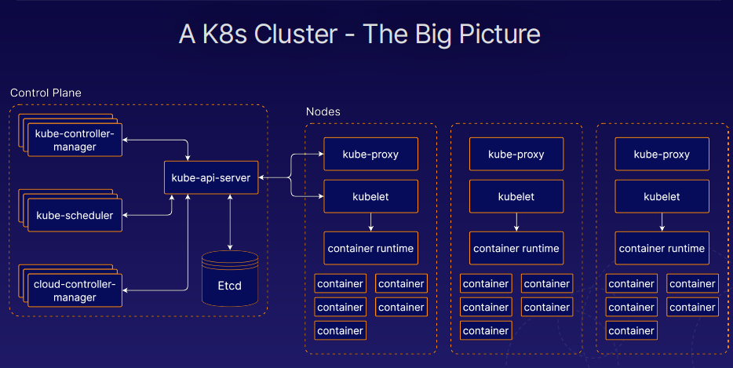
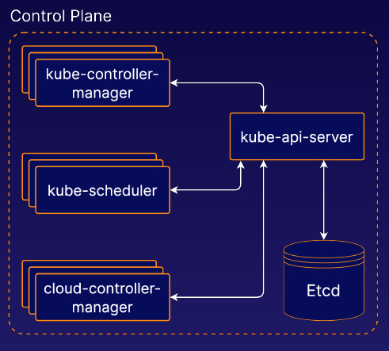
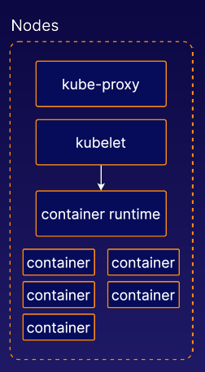
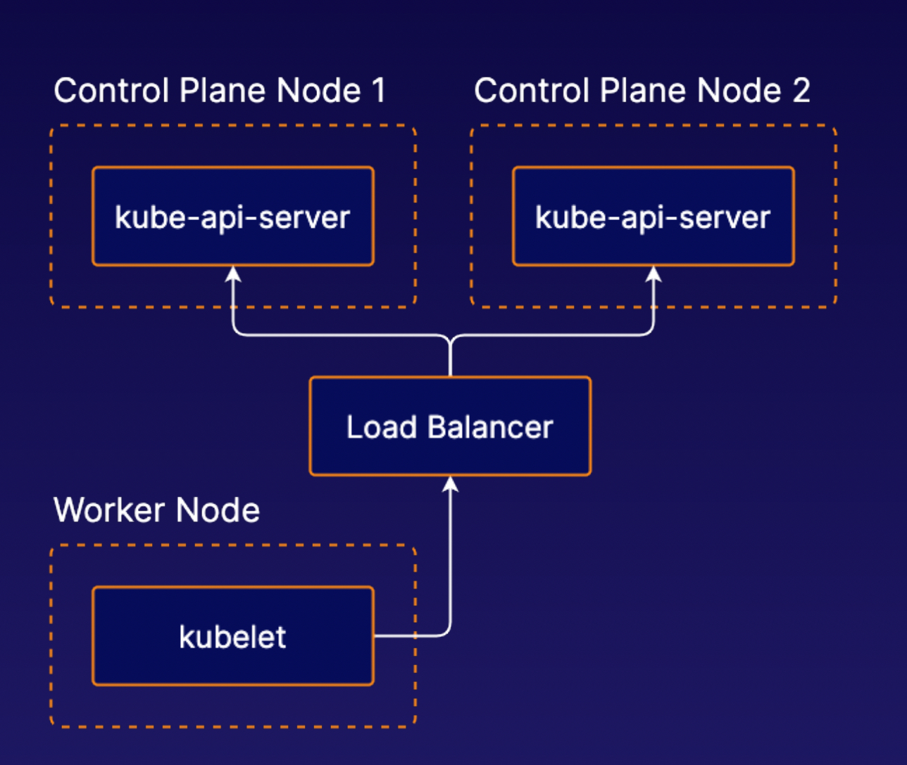
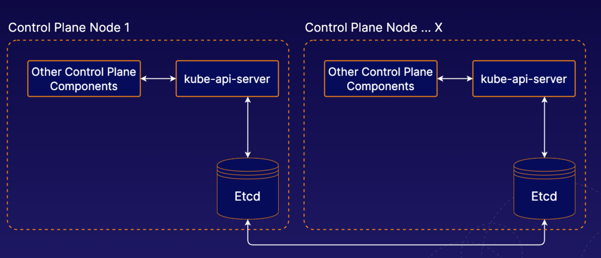
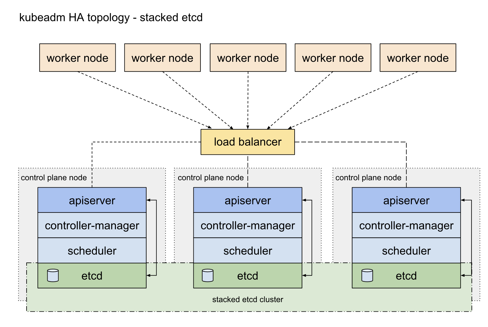
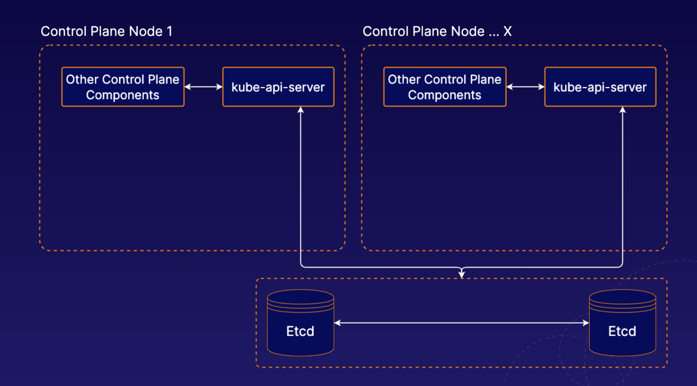
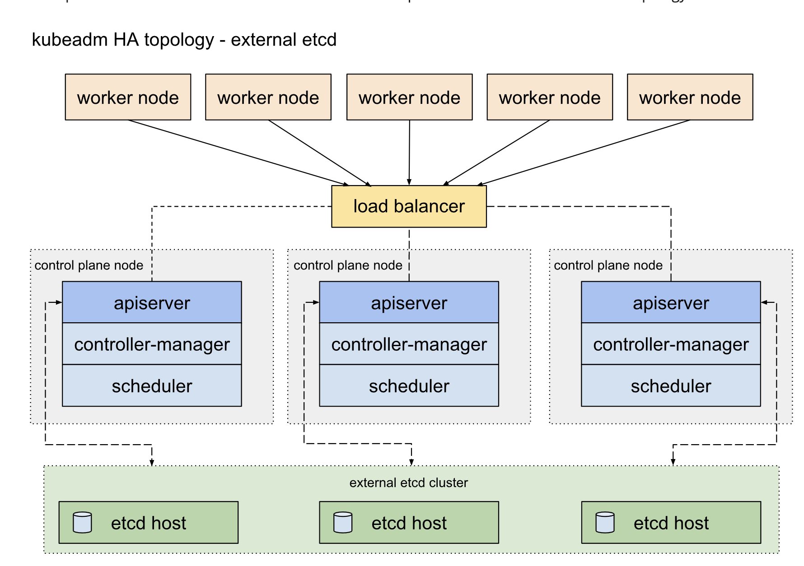

# Certified Kubernetes Administrator (CKA) Study Notes

## What is Kubernetes

- Kubernetes is a portable, extensible, open-source platform for managing containerized workloads and services, that
  facilitates both declarative configuration and automation.”\*\*

- Kubernetes makes it easier to build reliable, self-healing, and scalable applications.

## K8s Cluster



### K8s Control Plane



#### The Control Plane

- is a collection of multiple components responsible for managing the cluster itself globally.
- Essentially, the control plane controls the cluster.
- Individual control plane components can run on any machine in the cluster, but usually are run on dedicated controller
  machines.

#### Kube-api-server

- serves the Kubernetes API, the primary interface to

#### Etcd

- is the backend data store for the Kubernetes cluster. It provides high-availability storage for all data relating to
  the state of the cluster.

#### Kube-scheduler

- handles scheduling, the process of selecting an available node in the cluster on which to run containers.

#### Kube-controller-manager

- runs a collection of multiple controller utilities in a single process. These controllers carry out a variety of
  automation-related tasks within the Kubernetes cluster.

#### Cloud-controller-manager

- provides an interface between Kubernetes and various cloud platforms. It is only used when using using cloud-based
  resources alongside Kubernetes.

### K8s Nodes



- are the machines where the containers managed by the cluster run. A cluster can have any number of nodes.
- Various node components manage containers on the machine and communicate with the control plane.

#### Kubelet

- is the Kubernetes agent that runs on each node.
- It communicates with the control plane and ensures that containers are run on its node as instructed by the control
  plane.
- Kubelet also handles the process of reporting container status and other data about containers back to the control
  plane.

#### The Container Runtime

- is not built into Kubernetes.
- It is a separate piece of software that is responsible for actually running containers on the machine.
- Kubernetes supports multiple container runtime implementations.
- Some popular container runtimes are Docker and containerd.

#### Kube-proxy

- is a network proxy.
- It runs on each node and handles some tasks related to providing networking between containers and services in the
  cluster.

## Building a Kubernetes Cluster with Kubeadm

![[lab_diagram_1030_-_S02-LAB01_Building_a_Kubernetes_1.20_Cluster_with_Kubeadm.png]]

- _Kubeadm_ is a cluster setup tool.

### Install Packages

1. Log into the Control Plane Node _(Note: The following steps must be performed on all three nodes.)._
2. Create configuration file for containerd:

```bash
cat <<EOF | sudo tee /etc/modules-load.d/containerd.conf
overlay
br_netfilter
EOF
```

1. Load modules:

```bash
sudo modprobe overlay
sudo modprobe br_netfilter
```

1. Set system configurations for Kubernetes networking:

```bash
cat <<EOF | sudo tee /etc/sysctl.d/99-kubernetes-cri.conf
net.bridge.bridge-nf-call-iptables = 1
net.ipv4.ip_forward = 1
net.bridge.bridge-nf-call-ip6tables = 1
EOF
```

1. Apply new settings:

```bash
sudo sysctl --system
```

1. Install containerd:

```bash
sudo apt-get update && sudo apt-get install -y containerd
```

1. Create default configuration file for containerd:

```bash
sudo mkdir -p /etc/containerd
```

1. Generate default containerd configuration and save to the newly created default file:

```bash
sudo containerd config default | sudo tee /etc/containerd/config.toml
```

1. Restart containerd to ensure new configuration file usage:

```bash
sudo systemctl restart containerd
```

1. Verify that containerd is running.

```bash
sudo systemctl status containerd
```

1. Disable swap:

```bash
sudo swapoff -a
```

1. Disable swap on startup in `/etc/fstab`:

```bash
sudo sed -i '/ swap / s/^\(.*\)$/#\1/g' /etc/fstab
```

1. Install dependency packages:

```bash
sudo apt-get update && sudo apt-get install -y apt-transport-https curl
```

1. Download and add GPG key:

```bash
curl -s https://packages.cloud.google.com/apt/doc/apt-key.gpg | sudo apt-key add -
```

1. Add Kubernetes to repository list:

```bash
cat <<EOF | sudo tee /etc/apt/sources.list.d/kubernetes.list
deb https://apt.kubernetes.io/ kubernetes-xenial main
EOF
```

1. Update package listings:

```bash
sudo apt-get update
```

1. Install Kubernetes packages (Note: If you get a dpkg lock message, just wait a minute or two before trying the
    command again):

```bash
sudo apt-get install -y kubelet=1.22.0-00 kubeadm=1.22.0-00 kubectl=1.22.0-00
```

1. Turn off automatic updates:

```bash
sudo apt-mark hold kubelet kubeadm kubectl
```

1. Log into both Worker Nodes to perform previous steps.

### Initialize the Cluster

1. Initialize the Kubernetes cluster on the control plane node using kubeadm _(Note: This is only performed on the
   Control Plane Node)_:

```bash
sudo kubeadm init --pod-network-cidr 192.168.0.0/16 --kubernetes-version 1.22.0
```

1. Set kubectl access:

```bash
mkdir -p $HOME/.kube
sudo cp -i /etc/kubernetes/admin.conf $HOME/.kube/config
sudo chown $(id -u):$(id -g) $HOME/.kube/config
```

1. Test access to cluster:

```bash
kubectl get nodes
```

### Install the Calico Network Add-on

1. On the Control Plane Node, install Calico Networking:

```bash
kubectl apply -f https://docs.projectcalico.org/manifests/calico.yaml
```

1. Check status of the control plane node:

```bash
kubectl get nodes
```

### Join the Worker Nodes to the Cluster

1. In the Control Plane Node, create the token and copy the kubeadm join command _(NOTE:The join command can also be
   found in the output from `kubeadm init` command)_:

```bash
kubeadm token create --print-join-command
```

1. In both Worker Nodes, paste the kubeadm join command to join the cluster. Use sudo to run it as root:

```bash
sudo kubeadm join ...
```

1. In the Control Plane Node, view cluster status (Note: You may have to wait a few moments to allow all nodes to become
   ready):

```bash
$ kubectl get nodes
```

## Using Namespaces in K8s

### What is a Namespace?

- Namespaces are virtual clusters backed by the same physical cluster.
- Kubernetes objects, such as pods and containers, live in namespaces.
- Namespaces are a way to separate and organize objects in your cluster.

### Namespaces Commands

```bash
$ kubectl get namespaces

$ kubectl get pods --namespace my-namespace

$ kubectl create namespace my-namespace

# List the current namespaces:
$ kubectl get namespace

# Get all the pods in the cluster
$kubectl get pods --all-namespaces

```

## High Availability in K8s

- K8s facilitates high-availability applications, but you can also design the cluster itself to be highly available.
- To do this, you need multiple control plane nodes.

### High Availability Control Plane



When using multiple control planes for high availability, you will likely need to communicate with the Kubernetes API
through a **load balancer**. This includes clients such as **kubelet** instances running on worker nodes.

### Stacked Etcd





### External Etcd





## K8s Management Tools

### Kubectl

**kubectl** is the official command line interface for Kubernetes.

### Kubeadm

**kubeadm** is a tool for quickly and easily creating Kubernetes clusters.

### Minikube

**Minikube** allows you to automatically set up a local single-node Kubernetes cluster. It is great for getting
Kubernetes up and running quickly for development purposes.

### Helm

**Helm** provides templating and package management for Kubernetes objects. You can use it to manage your own
templates (known as charts). You can also download and use shared templates.

### Kompose

**Kompose** helps you translate Docker compose files into Kubernetes objects. If you are using Docker compose for some
part of your workflow, you can move your application to Kubernetes easily with Kompose.

### Kustomize

**Kustomize** is a configuration management tool for managing Kubernetes object configurations. It allows you to share
and re-use templated configurations for Kubernetes applications.

## Safely Draining a K8s Node

### What is Draining?

When performing maintenance, you may sometimes need to remove a Kubernetes node from service. To do this, you can **
drain** the node. Containers running on the node will be gracefully terminated (and potentially rescheduled on another
node).

### Draining a Node

To drain a node, use the kubectl drain command.

```bash
$ kubectl drain <node name>
```

When draining a node, you may need to ignore DaemonSets (pods that are tied to each node). If you have any DaemonSet
pods running on the node, you will likely need to use the --ignore-daemonsets flag.

```bash
$ kubectl drain <node name> --ignore-daemonsets
```

### Uncordoning a Node

If the node remains part of the cluster, you can allow pods to run on the node again when maintenance is complete using
the kubectl uncordon command.

```bash
$ kubectl uncordon <node name>
```

## Upgrading K8s with Kubeadm

When using Kubernetes, you will likely want to periodically upgrade Kubernetes to keep your cluster up to date.

### Control Plane Upgrade Steps

- Upgrade kubeadm on the control plane node.
- Drain the control plane node.
- Plan the upgrade (kubeadm upgrade plan).
- Apply the upgrade (kubeadm upgrade apply).
- Uncordon the control plane node.
- Upgrade kubelet and kubectl on the control plane node.

### Worker Node Upgrade Steps

- Upgrade kubeadm.
- Drain the node.
- Upgrade the kubelet configuration (kubeadm upgrade node).
- Upgrade kubelet and kubectl.
- Uncordon the node.

### Performing a Kubernetes Upgrade with Kubeadm

#### Upgrade the Control Plane

1. Upgrade kubeadm:

```bash
[cloud_user@k8s-control]$ sudo apt-get update && \
sudo apt-get install -y --allow-change-held-packages kubeadm=1.22.2-00
```

1. Make sure it upgraded correctly:

```bash
[cloud_user@k8s-control]$ kubeadm version
```

1. Drain the control plane node:

```bash
[cloud_user@k8s-control]$ kubectl drain k8s-control --ignore-daemonsets
```

1. Plan the upgrade:

```bash
[cloud_user@k8s-control]$ sudo kubeadm upgrade plan v1.22.2
```

1. Upgrade the control plane components:

```bash
[cloud_user@k8s-control]$ sudo kubeadm upgrade apply v1.22.2
```

1. Upgrade kubelet and kubectl on the control plane node:

```bash
[cloud_user@k8s-control]$ sudo apt-get update && \
sudo apt-get install -y --allow-change-held-packages kubelet=1.22.2-00 kubectl=1.22.2-00
```

1. Restart kubelet:

```bash
[cloud_user@k8s-control]$ sudo systemctl daemon-reload
```

```bash
[cloud_user@k8s-control]$ sudo systemctl restart kubelet
```

1. Uncordon the control plane node:

```bash
[cloud_user@k8s-control]$ kubectl uncordon k8s-control
```

1. Verify the control plane is working:

```bash
[cloud_user@k8s-control]$ kubectl get nodes
```

If it shows a `NotReady` status, run the command again after a minute or so. It should become `Ready`.

#### Upgrade the Worker Nodes

> **Note:** In a real-world scenario, you should not perform upgrades on all worker nodes at the same time. Make sure enough nodes are available at any given time to provide uninterrupted service.

##### Worker Node 1

1. Run the following on the _control plane node_ to drain worker node 1:

```bash
[cloud_user@k8s-control]$ kubectl drain k8s-worker1 --ignore-daemonsets --force
```

You may get an error message that certain pods couldn't be deleted, which is fine.

1. In a new terminal window, log in to worker node 1:

```bash
ssh cloud_user@<WORKER_1_PUBLIC_IP_ADDRESS>
```

1. Upgrade kubeadm on worker node 1:

```bash
[cloud_user@k8s-worker1]$ sudo apt-get update && \
sudo apt-get install -y --allow-change-held-packages kubeadm=1.22.2-00
```

```bash
[cloud_user@k8s-worker1]$ kubeadm version
```

1. Back on _worker node 1_, upgrade the kubelet configuration on the worker node:

```bash
[cloud_user@k8s-worker1]$ sudo kubeadm upgrade node
```

1. Upgrade kubelet and kubectl on worker node 1:

```bash
[cloud_user@k8s-worker1]$ sudo apt-get update && \
sudo apt-get install -y --allow-change-held-packages kubelet=1.22.2-00 kubectl=1.22.2-00
```

1. Restart kubelet:

```bash
[cloud_user@k8s-worker1]$ sudo systemctl daemon-reload
```

```bash
[cloud_user@k8s-worker1]$ sudo systemctl restart kubelet
```

1. From the _control plane node_, uncordon worker node 1:

```bash
[cloud_user@k8s-control]$ kubectl uncordon k8s-worker1
```

##### Worker Node 2

1. From the _control plane node_, drain worker node 2:

```bash
[cloud_user@k8s-control]$ kubectl drain k8s-worker2 --ignore-daemonsets --force
```

1. In a new terminal window, log in to worker node 2:

```bash
ssh cloud_user@<WORKER_2_PUBLIC_IP_ADDRESS>
```

1. Upgrade kubeadm:

```bash
[cloud_user@k8s-worker2]$ sudo apt-get update && \
sudo apt-get install -y --allow-change-held-packages kubeadm=1.22.2-00
```

```bash
[cloud_user@k8s-worker2]$ kubeadm version
```

1. Back on _worker node 2_, perform the upgrade:

```bash
[cloud_user@k8s-worker2]$ sudo kubeadm upgrade node
```

```bash
[cloud_user@k8s-worker2]$ sudo apt-get update && \
sudo apt-get install -y --allow-change-held-packages kubelet=1.22.2-00 kubectl=1.22.2-00
```

```bash
[cloud_user@k8s-worker2]$ sudo systemctl daemon-reload
```

```bash
[cloud_user@k8s-worker2]$ sudo systemctl restart kubelet
```

1. From the _control plane node_, uncordon worker node 2:

```bash
[cloud_user@k8s-control]$ kubectl uncordon k8s-worker2
```

1. Still in the _control plane node_, verify the cluster is upgraded and working:

```bash
[cloud_user@k8s-control]$ kubectl get nodes
```

If they show a `NotReady` status, run the command again after a minute or so. They should become `Ready`.

## REF

- [01-building-a-kubernetes-cluster.pdf](./k8s-study-notes/01-building-a-kubernetes-cluster.pdf)
- [certified-kubernetes-administrator-all-sections-combined.pdf](./k8s-study-notes/certified-kubernetes-administrator-all-sections-combined.pdf)
- [s01-introduction.pdf](./k8s-study-notes/s01-introduction.pdf)
- [s03-l04-safely-draining-a-k8s-node.pdf](./k8s-study-notes/s03-l04-safely-draining-a-k8s-node.pdf)
- [s03-l05-upgrading-k8s-with-kubeadm.pdf](./k8s-study-notes/s03-l05-upgrading-k8s-with-kubeadm.pdf)
- [s03-l06-backing-up-and-restoring-etcd-cluster-data.pdf](./k8s-study-notes/s03-l06-backing-up-and-restoring-etcd-cluster-data.pdf)
