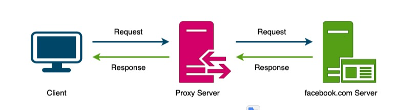

# Proxies

## What is a Proxy Server?

- A proxy server is an intermediate piece of software or hardware that sits between the client and the server.

## Forward Proxy

- Typically, forward proxies are used to cache data, filter requests, log requests, or transform requests (by adding/removing headers, encrypting/decrypting, or compressing a resource).

A Forward Proxy

- *A forward proxy can hide the identity of the client from the server by sending requests on behalf of the client.*
- In addition to coordinating requests from multiple servers, proxies can also optimise request traffic from a system-wide perspective.
- Proxies can combine the same data access requests into one request and then return the result to the user; this technique is called **collapsed forwarding**.
- Consider a request for the same data across several nodes, but the data is not in cache. By routing these requests through the proxy, they can be consolidated into one so that we will only read data from the disk once.

## Reverse Proxy

- A reverse proxy retrieves resources from one or more servers on behalf of a client.
- These resources are then returned to the client, appearing as if they originated from the proxy server itself, thus anonymising the server.
- A reverse proxy, just like a forward proxy, can be used for caching, load balancing, anonymising the servers, or routing requests to the appropriate servers.

Contrary to the forward proxy, which hides the client's identity, a reverse proxy hides the server's identity

