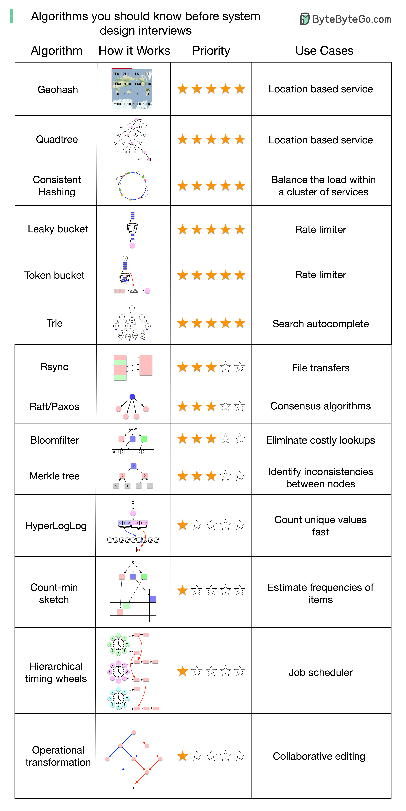

# Notes

[The Reactive Principles](https://principles.reactive.foundation/principles/index.html)

[Cassandra use cases: when to use and when not to use cassandra](https://blog.pythian.com/cassandra-use-cases/)
